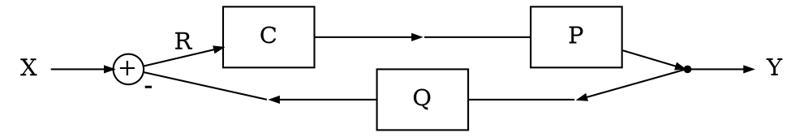

# Feedback control system

## Plant, Controller, and Sensor

**System function**

```[latex]
H(s) = \frac{C(s)P(s)}{1 + C(s)P(s)Q(s)}
```

**Block diagram**



## Stability test

TODO

## Applications

TODO: exclusive to feedback control. don't put something for LTI in general

## Common discrepancies

TODO

## Reference(s)

- M. D. Adams, _Signals and Systems_, 3rd ed. The University of Victoria, Victoria, British Columbia, Canada, 2020.